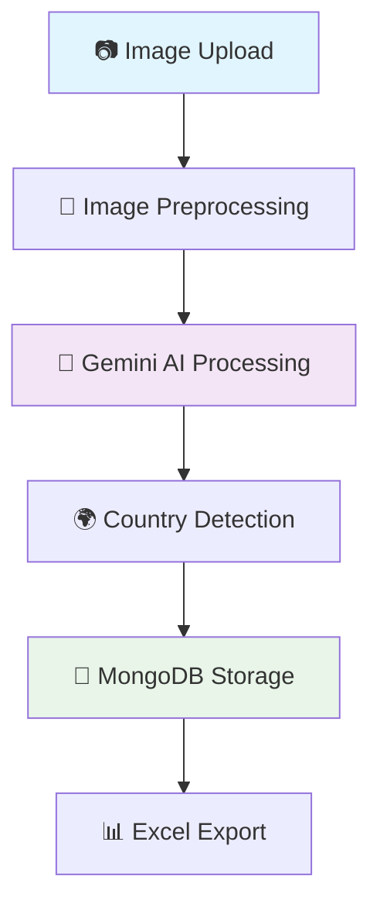

# 🎯 AI-Powered Visiting Card Scanner

<div align="center">


<h3>🚀 Extract structured data from visiting cards using Google's Gemini Vision AI</h3>

[](https://creativecommons.org/licenses/by-nc/4.0/)


</div>

---

## ✨ Features

| Feature | Description |
|---------|-------------|
| 🤖 **AI-Powered Extraction** | Uses Google Gemini Vision API for accurate text recognition |
| 📤 **Bulk Upload Support** | Process multiple visiting cards simultaneously |
| 🗄️ **MongoDB Integration** | Persistent data storage with full CRUD operations |
| 📊 **Excel Export** | Download extracted data as spreadsheet files |
| 🌍 **Country Detection** | Automatic country identification with flag emojis |
| ⚡ **Real-time Progress** | Live updates during bulk processing |
| 🎨 **Modern UI** | Clean, responsive web interface |
| 🔧 **Easy Management** | Edit and delete records through web interface |

---

## 🛠️ Technology Stack

<div align="center">

| Component | Technology | Purpose |
|-----------|------------|---------|
| **🤖 AI Engine** | Google Gemini Vision API | Text extraction from images |
| **🐍 Backend** | Flask 3.0+ | Web framework |
| **🗄️ Database** | MongoDB | Data persistence |
| **📦 Package Manager** | uv | Fast Python package management |
| **🖼️ Image Processing** | Pillow (PIL) | Image preprocessing |
| **🌐 Frontend** | HTML5 + CSS3 + JavaScript | User interface |
| **📄 Export** | openpyxl | Excel file generation |

</div>

---

## 🚀 Quick Start

### 📋 Prerequisites

<table>
<tr>
<td width="50%">

**🐍 Python Environment**
- Python 3.12 or higher
- uv package manager

</td>
<td width="50%">

**🔑 Required Services**
- MongoDB (local or cloud)
- Google Gemini API key

</td>
</tr>
</table>

### 🎯 Installation Steps

#### 1️⃣ Clone Repository
```bash
git clone <your-repository-url>
cd OCR_bulk_scanner
```

#### 2️⃣ Install uv Package Manager
```bash
# macOS/Linux
curl -LsSf https://astral.sh/uv/install.sh | sh

# Windows
powershell -c "irm https://astral.sh/uv/install.ps1 | iex"
```

#### 3️⃣ Install Dependencies
```bash
# Install all dependencies using uv
uv pip install -e .

# Alternative: Create virtual environment first
uv venv
source .venv/bin/activate  # On Windows: .venv\Scripts\activate
uv pip install -e .
```

#### 4️⃣ Environment Configuration
Create `.env` file in project root:

```env
# 🤖 Gemini AI Configuration
GEMINI_API_KEY=your-gemini-api-key-here

# 🌶️ Flask Configuration
SECRET_KEY=your-secret-key-here

# 🍃 MongoDB Configuration
MONGODB_URI=mongodb://localhost:27017/
MONGODB_DATABASE=visiting_card_db
MONGODB_COLLECTION=extractions
```

#### 5️⃣ Get Gemini API Key
1. 🌐 Visit [Google AI Studio](https://makersuite.google.com/app/apikey)
2. 🔑 Create a new API key
3. 📋 Copy and paste it into your `.env` file

#### 6️⃣ Launch Application
```bash
# Using uv (recommended)
uv run python main.py

# Or with activated virtual environment
python main.py
```

#### 7️⃣ Access the App
Open your browser and navigate to: **http://localhost:5000** 🌐

---

## 📖 How to Use

### 📸 Single Image Processing

<div align="center">

| Step | Action | Result |
|------|--------|--------|
| **1** | 🏠 Navigate to home page | Upload interface loads |
| **2** | 📁 Click "Choose Files" | File browser opens |
| **3** | 🖼️ Select visiting card image | Image preview shows |
| **4** | 🚀 Click "Upload and Extract" | AI processes the image |
| **5** | 📊 View extracted data | See results with country flags 🇺🇸🇮🇳🇬🇧 |

</div>

### 📁 Bulk Processing
- Select multiple images using **Ctrl/Cmd + Click**
- Upload all files simultaneously
- Monitor **real-time progress bar**
- Download **consolidated Excel report**

### 🔧 Data Management
- **👀 View**: All extracted records in management panel
- **✏️ Edit**: Modify data inline with instant updates
- **🗑️ Delete**: Remove unwanted entries
- **📄 Export**: Generate Excel files with filtered data

---

## 📁 Project Architecture

```
OCR_bulk_scanner/
├── 🐍 main.py                    # Application entry point
├── 📋 pyproject.toml             # uv package configuration
├── 🔒 uv.lock                   # Dependency lock file
├── 📄 LICENSE                   # Creative Commons license
├── 📖 README.md                 # This documentation
│
├── 📦 app/                      # Core application package
│   ├── 🔧 __init__.py           # Flask app factory
│   ├── 🛣️ routes.py             # API endpoints & views
│   ├── 🤖 ocr.py                # Gemini AI integration
│   ├── 🗄️ mongo.py              # MongoDB operations
│   └── 🛠️ utils.py              # Helper functions
│
├── 🎨 static/                   # Static web assets
│   ├── 💄 css/style.css         # Application styling
│   ├── ⚡ js/                   # JavaScript files
│   │   ├── script.js            # Main functionality
│   │   └── manage.js            # Data management
│   ├── 📤 uploads/              # Temporary file storage
│   └── 📊 results/              # Processing results
│
└── 🌐 templates/                # HTML templates
    ├── 🏠 index.html            # Main upload interface
    ├── 📋 manage.html           # Data management panel
    └── 📊 results.html          # Results display page
```

---

## 🔗 API Reference

<div align="center">

| Method | Endpoint | Description | Response |
|--------|----------|-------------|----------|
| `GET` | `/` | 🏠 Home page with upload form | HTML page |
| `POST` | `/upload` | 📤 Handle file uploads & AI processing | JSON results |
| `GET` | `/results` | 📊 Display extraction results | HTML page |
| `GET` | `/manage` | 🔧 Data management interface | HTML page |
| `POST` | `/api/update-record` | ✏️ Update extraction record | JSON status |
| `POST` | `/api/delete-record` | 🗑️ Delete extraction record | JSON status |
| `GET` | `/download-excel` | 📄 Export data to Excel | Excel file |

</div>

---

## 🔮 How It Works

<div align="center">



</div>

1. **📷 Image Upload**: Users upload visiting card images through the web interface
2. **🔄 Preprocessing**: Images are resized, converted to grayscale, and optimized for AI processing
3. **🤖 AI Processing**: Gemini Vision API analyzes the image and extracts structured data
4. **🌍 Country Detection**: Smart algorithm identifies country from address/phone patterns
5. **💾 Data Storage**: Results are saved to MongoDB with unique identifiers
6. **📊 Export**: Users can generate Excel files for easy data management

---

## 🎯 Key Features Deep Dive

### 🤖 Gemini AI Integration
- **🧠 Advanced Vision Model**: Uses Google's latest Gemini 1.5 Flash model
- **📋 Structured Output**: Returns consistent JSON format for all extractions
- **🌍 Multi-language Support**: Handles various card layouts and languages
- **⚡ Fast Processing**: Optimized for speed and accuracy

### 🗄️ MongoDB Storage
- **💾 Persistent Storage**: All data saved permanently in MongoDB
- **🔄 CRUD Operations**: Full Create, Read, Update, Delete functionality
- **📈 Scalable**: Handles large volumes of extraction records
- **🔍 Search & Filter**: Advanced querying capabilities

### 🌍 Smart Country Detection
- **🚩 40+ Countries Supported**: Automatic flag emoji assignment
- **📞 Phone Pattern Recognition**: Detects country from phone number formats
- **📍 Address Analysis**: Identifies location markers in text
- **🎯 Fallback Logic**: Multiple detection methods for accuracy

---

## 📊 Dependencies

This project uses the following key packages (managed by **uv**):

```toml
[project.dependencies]
Flask = ">=3.0.0"           # 🌶️ Web framework
Pillow = ">=10.1.0"         # 🖼️ Image processing
requests = ">=2.32.4"       # 🌐 HTTP requests for Gemini API
pymongo = ">=4.13.2"        # 🍃 MongoDB driver
openpyxl = ">=3.1.5"        # 📄 Excel file generation
python-dotenv = ">=1.0.0"   # 🔐 Environment variables
pycountry = ">=24.6.1"      # 🌍 Country data and flags
```

---

## 🚀 Deployment Guide

### 🖥️ VPS Deployment (Production)

#### 📋 Prerequisites for VPS
- **🐧 Linux VPS** (Ubuntu 20.04+ recommended)
- **🔑 SSH Access** to your server
- **🌐 Domain name** (optional but recommended)
- **💾 Minimum 1GB RAM**, 1 CPU core, 10GB storage

#### 🛠️ Step 1: Server Setup

```bash
# Connect to your VPS
ssh username@your-server-ip

# Update system packages
sudo apt update && sudo apt upgrade -y

# Install essential packages
sudo apt install -y python3 python3-pip python3-venv nginx git curl supervisor
```

#### 🐍 Step 2: Python Environment Setup

```bash
# Install uv package manager
curl -LsSf https://astral.sh/uv/install.sh | sh
source ~/.bashrc

# Create application directory
sudo mkdir -p /var/www/ocr-scanner
sudo chown $USER:$USER /var/www/ocr-scanner
cd /var/www/ocr-scanner

# Clone your repository
git clone https://github.com/your-username/OCR_scanner_script.git .
```

#### ⚙️ Step 3: Application Configuration

```bash
# Create virtual environment
uv venv --python 3.12
source .venv/bin/activate

# Install dependencies
uv pip install -e .

# Create production environment file
sudo nano .env
```

**Production `.env` configuration:**
```env
# 🤖 Gemini AI Configuration
GEMINI_API_KEY=your-gemini-api-key-here

# 🌶️ Flask Configuration (Production)
SECRET_KEY=your-very-secure-secret-key-here
FLASK_ENV=production
FLASK_DEBUG=False

# 🍃 MongoDB Configuration
MONGODB_URI=mongodb://localhost:27017/
MONGODB_DATABASE=visiting_card_production
MONGODB_COLLECTION=extractions

# 🔧 Production Settings
MAX_CONTENT_LENGTH=16777216  # 16MB
UPLOAD_FOLDER=/var/www/ocr-scanner/static/uploads
RESULTS_FOLDER=/var/www/ocr-scanner/static/results
```

#### 🗄️ Step 4: MongoDB Setup

```bash
# Install MongoDB
wget -qO - https://www.mongodb.org/static/pgp/server-7.0.asc | sudo apt-key add -
echo "deb [ arch=amd64,arm64 ] https://repo.mongodb.org/apt/ubuntu focal/mongodb-org/7.0 multiverse" | sudo tee /etc/apt/sources.list.d/mongodb-org-7.0.list
sudo apt update
sudo apt install -y mongodb-org

# Start and enable MongoDB
sudo systemctl start mongod
sudo systemctl enable mongod

# Verify MongoDB is running
sudo systemctl status mongod
```

#### 🌐 Step 5: Nginx Configuration

Create Nginx configuration:
```bash
sudo nano /etc/nginx/sites-available/ocr-scanner
```

**Nginx configuration file:**
```nginx
server {
    listen 80;
    server_name your-domain.com www.your-domain.com;  # Replace with your domain

    location / {
        proxy_pass http://127.0.0.1:5000;
        proxy_set_header Host $host;
        proxy_set_header X-Real-IP $remote_addr;
        proxy_set_header X-Forwarded-For $proxy_add_x_forwarded_for;
        proxy_set_header X-Forwarded-Proto $scheme;
        
        # Handle large file uploads
        client_max_body_size 20M;
        proxy_read_timeout 300;
        proxy_connect_timeout 300;
        proxy_send_timeout 300;
    }

    # Serve static files directly
    location /static {
        alias /var/www/ocr-scanner/static;
        expires 1d;
        add_header Cache-Control "public, immutable";
    }

    # Security headers
    add_header X-Content-Type-Options nosniff;
    add_header X-Frame-Options DENY;
    add_header X-XSS-Protection "1; mode=block";
}
```

Enable the site:
```bash
sudo ln -s /etc/nginx/sites-available/ocr-scanner /etc/nginx/sites-enabled/
sudo nginx -t  # Test configuration
sudo systemctl reload nginx
```

#### 🔧 Step 6: Process Management with Supervisor

Create supervisor configuration:
```bash
sudo nano /etc/supervisor/conf.d/ocr-scanner.conf
```

**Supervisor configuration:**
```ini
[program:ocr-scanner]
command=/var/www/ocr-scanner/.venv/bin/python main.py
directory=/var/www/ocr-scanner
user=www-data
autostart=true
autorestart=true
redirect_stderr=true
stdout_logfile=/var/log/ocr-scanner.log
stderr_logfile=/var/log/ocr-scanner-error.log
environment=FLASK_ENV=production
```

Start the application:
```bash
sudo supervisorctl reread
sudo supervisorctl update
sudo supervisorctl start ocr-scanner
sudo supervisorctl status ocr-scanner
```

#### 🔒 Step 7: SSL Certificate (Let's Encrypt)

```bash
# Install Certbot
sudo apt install -y certbot python3-certbot-nginx

# Get SSL certificate
sudo certbot --nginx -d your-domain.com -d www.your-domain.com

# Test auto-renewal
sudo certbot renew --dry-run
```

#### 🔥 Step 8: Firewall Configuration

```bash
# Configure UFW firewall
sudo ufw allow OpenSSH
sudo ufw allow 'Nginx Full'
sudo ufw enable
sudo ufw status
```

### 🐳 Docker Deployment (Alternative)

Create `Dockerfile`:
```dockerfile
FROM python:3.12-slim

# Set working directory
WORKDIR /app

# Install system dependencies
RUN apt-get update && apt-get install -y \
    gcc \
    && rm -rf /var/lib/apt/lists/*

# Install uv
RUN pip install uv

# Copy project files
COPY pyproject.toml uv.lock ./
COPY . .

# Install dependencies
RUN uv pip install --system -e .

# Create uploads directory
RUN mkdir -p static/uploads static/results

# Expose port
EXPOSE 5000

# Set environment to production
ENV FLASK_ENV=production
ENV FLASK_DEBUG=False

# Run application
CMD ["python", "main.py"]
```

Create `docker-compose.yml`:
```yaml
version: '3.8'
services:
  web:
    build: .
    ports:
      - "5000:5000"
    environment:
      - MONGODB_URI=mongodb://mongo:27017/
      - GEMINI_API_KEY=${GEMINI_API_KEY}
      - SECRET_KEY=${SECRET_KEY}
    depends_on:
      - mongo
    volumes:
      - ./static/uploads:/app/static/uploads
      - ./static/results:/app/static/results

  mongo:
    image: mongo:7.0
    ports:
      - "27017:27017"
    volumes:
      - mongo_data:/data/db

volumes:
  mongo_data:
```

Deploy with Docker:
```bash
# Build and run
docker-compose up -d

# View logs
docker-compose logs -f web
```

### ☁️ Cloud Platform Deployment

#### 🔥 Heroku Deployment
```bash
# Install Heroku CLI
npm install -g heroku

# Login and create app
heroku login
heroku create your-app-name

# Add MongoDB addon
heroku addons:create mongolab:sandbox

# Set environment variables
heroku config:set GEMINI_API_KEY=your-key
heroku config:set SECRET_KEY=your-secret

# Deploy
git push heroku main
```

#### 🌊 Railway Deployment
1. Connect your GitHub repository
2. Set environment variables in dashboard
3. Deploy automatically on push

#### ⚡ DigitalOcean App Platform
```yaml
# app.yaml
name: ocr-scanner
services:
- name: web
  source_dir: /
  github:
    repo: your-username/OCR_scanner_script
    branch: main
  run_command: python main.py
  environment_slug: python
  instance_count: 1
  instance_size_slug: basic-xxs
  envs:
  - key: GEMINI_API_KEY
    value: your-key
  - key: SECRET_KEY
    value: your-secret
databases:
- name: mongo
  engine: MONGODB
  version: "5"
```

---

## 🔧 Production Configuration & Code Changes

### 📝 Required Code Modifications for Production

#### 1️⃣ Update `main.py` for Production
```python
from app import create_app
import os

app = create_app()

if __name__ == '__main__':
    # Production settings
    port = int(os.environ.get('PORT', 5000))
    debug = os.environ.get('FLASK_DEBUG', 'False').lower() == 'true'
    
    app.run(
        debug=debug,
        host='0.0.0.0',
        port=port,
        threaded=True  # Enable threading for better performance
    )
```

#### 2️⃣ Environment-based Configuration
Create `app/config.py`:
```python
import os
from dotenv import load_dotenv

load_dotenv()

class Config:
    SECRET_KEY = os.environ.get('SECRET_KEY') or 'dev-secret-key'
    GEMINI_API_KEY = os.environ.get('GEMINI_API_KEY')
    MONGODB_URI = os.environ.get('MONGODB_URI', 'mongodb://localhost:27017/')
    MONGODB_DATABASE = os.environ.get('MONGODB_DATABASE', 'visiting_card_db')
    MONGODB_COLLECTION = os.environ.get('MONGODB_COLLECTION', 'extractions')
    
    # File upload settings
    MAX_CONTENT_LENGTH = int(os.environ.get('MAX_CONTENT_LENGTH', 16 * 1024 * 1024))
    UPLOAD_FOLDER = os.environ.get('UPLOAD_FOLDER', 'static/uploads')
    RESULTS_FOLDER = os.environ.get('RESULTS_FOLDER', 'static/results')

class DevelopmentConfig(Config):
    DEBUG = True
    FLASK_ENV = 'development'

class ProductionConfig(Config):
    DEBUG = False
    FLASK_ENV = 'production'
    
    # Production security settings
    SESSION_COOKIE_SECURE = True
    SESSION_COOKIE_HTTPONLY = True
    PERMANENT_SESSION_LIFETIME = 1800  # 30 minutes

config = {
    'development': DevelopmentConfig,
    'production': ProductionConfig,
    'default': DevelopmentConfig
}
```

#### 3️⃣ Update Flask App Factory
Modify `app/__init__.py`:
```python
from flask import Flask
from .config import config
import os

def create_app(config_name=None):
    app = Flask(__name__)
    
    # Load configuration
    config_name = config_name or os.environ.get('FLASK_ENV', 'default')
    app.config.from_object(config[config_name])
    
    # Register routes
    from .routes import main
    app.register_blueprint(main)
    
    # Create upload directories
    os.makedirs(app.config['UPLOAD_FOLDER'], exist_ok=True)
    os.makedirs(app.config['RESULTS_FOLDER'], exist_ok=True)
    
    return app
```

#### 4️⃣ Production Logging Setup
Add to `app/__init__.py`:
```python
import logging
from logging.handlers import RotatingFileHandler

def create_app(config_name=None):
    app = Flask(__name__)
    
    # ... existing code ...
    
    # Configure logging for production
    if not app.debug:
        if not os.path.exists('logs'):
            os.mkdir('logs')
        
        file_handler = RotatingFileHandler(
            'logs/ocr_scanner.log', 
            maxBytes=10240000, 
            backupCount=10
        )
        file_handler.setFormatter(logging.Formatter(
            '%(asctime)s %(levelname)s: %(message)s [in %(pathname)s:%(lineno)d]'
        ))
        file_handler.setLevel(logging.INFO)
        app.logger.addHandler(file_handler)
        
        app.logger.setLevel(logging.INFO)
        app.logger.info('OCR Scanner startup')
    
    return app
```

### 🔧 Security Enhancements

#### 1️⃣ Add Rate Limiting
Install flask-limiter:
```bash
uv add flask-limiter
```

Update `app/__init__.py`:
```python
from flask_limiter import Limiter
from flask_limiter.util import get_remote_address

def create_app(config_name=None):
    app = Flask(__name__)
    
    # Initialize rate limiter
    limiter = Limiter(
        app,
        key_func=get_remote_address,
        default_limits=["200 per day", "50 per hour"]
    )
    
    # ... rest of code ...
```

Add rate limits to routes in `app/routes.py`:
```python
from flask_limiter import Limiter
from flask_limiter.util import get_remote_address

# Add to upload route
@main.route('/upload', methods=['POST'])
@limiter.limit("10 per minute")
def upload_files():
    # ... existing code ...
```

#### 2️⃣ Input Validation
Add validation functions in `app/utils.py`:
```python
import os
from werkzeug.utils import secure_filename

ALLOWED_EXTENSIONS = {'png', 'jpg', 'jpeg', 'gif', 'bmp', 'tiff', 'webp'}
MAX_FILE_SIZE = 16 * 1024 * 1024  # 16MB

def allowed_file(filename):
    return '.' in filename and \
           filename.rsplit('.', 1)[1].lower() in ALLOWED_EXTENSIONS

def validate_file_size(file):
    if hasattr(file, 'content_length') and file.content_length:
        return file.content_length <= MAX_FILE_SIZE
    return True

def sanitize_filename(filename):
    return secure_filename(filename)
```

### 🔄 Database Connection Pooling
Update `app/mongo.py`:
```python
from pymongo import MongoClient
from pymongo.errors import ConnectionFailure
import os
import logging

class MongoDBConnection:
    _instance = None
    _client = None
    
    def __new__(cls):
        if cls._instance is None:
            cls._instance = super().__new__(cls)
        return cls._instance
    
    def __init__(self):
        if self._client is None:
            try:
                self._client = MongoClient(
                    os.environ.get('MONGODB_URI'),
                    maxPoolSize=50,  # Connection pooling
                    wtimeout=2500,
                    serverSelectionTimeoutMS=5000
                )
                # Test connection
                self._client.admin.command('ping')
                logging.info("Connected to MongoDB successfully")
            except ConnectionFailure as e:
                logging.error(f"Failed to connect to MongoDB: {e}")
                raise
    
    def get_database(self):
        db_name = os.environ.get('MONGODB_DATABASE', 'visiting_card_db')
        return self._client[db_name]
    
    def get_collection(self):
        db = self.get_database()
        collection_name = os.environ.get('MONGODB_COLLECTION', 'extractions')
        return db[collection_name]

# Usage in other files
mongo_connection = MongoDBConnection()
```

### 📊 Performance Monitoring

#### 1️⃣ Add Health Check Endpoint
Add to `app/routes.py`:
```python
@main.route('/health')
def health_check():
    try:
        # Test MongoDB connection
        mongo_connection.get_collection().find_one()
        
        return {
            'status': 'healthy',
            'timestamp': datetime.utcnow().isoformat(),
            'services': {
                'database': 'connected',
                'api': 'operational'
            }
        }, 200
    except Exception as e:
        return {
            'status': 'unhealthy',
            'error': str(e),
            'timestamp': datetime.utcnow().isoformat()
        }, 503
```

#### 2️⃣ Add Metrics Endpoint
```python
import psutil
from datetime import datetime

@main.route('/metrics')
def metrics():
    return {
        'system': {
            'cpu_percent': psutil.cpu_percent(),
            'memory_percent': psutil.virtual_memory().percent,
            'disk_usage': psutil.disk_usage('/').percent
        },
        'application': {
            'uptime': str(datetime.utcnow() - app.start_time),
            'requests_processed': app.config.get('REQUEST_COUNT', 0)
        }
    }
```

### 🚀 Performance Optimizations

#### 1️⃣ Image Optimization
Update `app/ocr.py`:
```python
from PIL import Image
import io

def optimize_image_for_processing(image_path, max_size=(1920, 1080), quality=85):
    """Optimize image for faster processing"""
    with Image.open(image_path) as img:
        # Convert to RGB if necessary
        if img.mode != 'RGB':
            img = img.convert('RGB')
        
        # Resize if too large
        img.thumbnail(max_size, Image.Resampling.LANCZOS)
        
        # Save optimized version
        output = io.BytesIO()
        img.save(output, format='JPEG', quality=quality, optimize=True)
        return output.getvalue()
```

#### 2️⃣ Caching
Add Redis caching:
```bash
uv add redis flask-caching
```

Update `app/__init__.py`:
```python
from flask_caching import Cache

def create_app(config_name=None):
    app = Flask(__name__)
    
    # Configure caching
    cache = Cache(app, config={
        'CACHE_TYPE': 'redis',
        'CACHE_REDIS_URL': os.environ.get('REDIS_URL', 'redis://localhost:6379/0')
    })
    
    # ... rest of code ...
```

### 📋 Deployment Checklist

Before deploying to production:

- [ ] ✅ Set strong `SECRET_KEY`
- [ ] ✅ Configure `GEMINI_API_KEY`
- [ ] ✅ Set up MongoDB with authentication
- [ ] ✅ Configure SSL certificate
- [ ] ✅ Set up firewall rules
- [ ] ✅ Configure backup strategy
- [ ] ✅ Set up monitoring and logging
- [ ] ✅ Test error handling
- [ ] ✅ Verify file upload limits
- [ ] ✅ Test with production data
- [ ] ✅ Set up automated deployments
- [ ] ✅ Configure domain and DNS
- [ ] ✅ Test performance under load

---

## 🔧 Troubleshooting & Maintenance

### 🚨 Common Issues & Solutions

#### 🔌 Connection Issues
```bash
# Check if services are running
sudo systemctl status nginx
sudo systemctl status mongod
sudo supervisorctl status ocr-scanner

# Check logs
sudo tail -f /var/log/nginx/error.log
sudo tail -f /var/log/ocr-scanner.log
sudo journalctl -u mongod -f
```

#### 💾 Storage Issues
```bash
# Check disk space
df -h

# Clean up old uploads (older than 7 days)
find /var/www/ocr-scanner/static/uploads -type f -mtime +7 -delete
find /var/www/ocr-scanner/static/results -type f -mtime +7 -delete

# Rotate logs
sudo logrotate /etc/logrotate.d/ocr-scanner
```

#### 🐌 Performance Issues
```bash
# Monitor system resources
htop
iostat 1
free -h

# Check MongoDB performance
mongo --eval "db.serverStatus().connections"
mongo --eval "db.stats()"

# Restart services if needed
sudo supervisorctl restart ocr-scanner
sudo systemctl restart nginx
```

### 🔄 Maintenance Tasks

#### 📅 Daily Tasks
```bash
#!/bin/bash
# daily-maintenance.sh

# Backup database
mongodump --db visiting_card_production --out /backups/$(date +%Y%m%d)

# Clean old files
find /var/www/ocr-scanner/static/uploads -type f -mtime +7 -delete
find /var/www/ocr-scanner/static/results -type f -mtime +7 -delete

# Check disk space
df -h | grep -E '9[0-9]%|100%' && echo "WARNING: Disk space low!"

# Rotate logs
sudo logrotate -f /etc/logrotate.d/ocr-scanner
```

#### 📊 Weekly Tasks
```bash
#!/bin/bash
# weekly-maintenance.sh

# Update system packages
sudo apt update && sudo apt upgrade -y

# Check SSL certificate expiry
sudo certbot certificates | grep -E "VALID|INVALID"

# Analyze MongoDB performance
mongo --eval "db.extractions.getIndexes()"
mongo --eval "db.extractions.stats()"

# Check application health
curl -f http://localhost:5000/health || echo "Health check failed!"
```

### 📈 Monitoring Setup

#### 📊 System Monitoring
Install monitoring tools:
```bash
# Install monitoring packages
sudo apt install -y htop iotop nethogs

# Install log analysis tools
sudo apt install -y goaccess

# Analyze web logs
sudo goaccess /var/log/nginx/access.log -c
```

#### 🔔 Alerting Setup
Create alert script:
```bash
#!/bin/bash
# alert-script.sh

# Check if application is responding
if ! curl -f http://localhost:5000/health; then
    echo "Application is down!" | mail -s "OCR Scanner Alert" admin@yourdomain.com
fi

# Check disk space
DISK_USAGE=$(df -h / | awk 'NR==2 {print $5}' | sed 's/%//')
if [ $DISK_USAGE -gt 90 ]; then
    echo "Disk usage is ${DISK_USAGE}%" | mail -s "Disk Space Alert" admin@yourdomain.com
fi
```

Add to crontab:
```bash
# Edit crontab
crontab -e

# Add monitoring checks
*/5 * * * * /path/to/alert-script.sh
0 2 * * * /path/to/daily-maintenance.sh
0 3 * * 0 /path/to/weekly-maintenance.sh
```

### 🔄 Updates & Deployment

#### 🚀 Automated Deployment Script
```bash
#!/bin/bash
# deploy.sh

set -e

echo "🚀 Starting deployment..."

# Navigate to application directory
cd /var/www/ocr-scanner

# Backup current version
sudo cp -r . /backups/ocr-scanner-$(date +%Y%m%d-%H%M%S)

# Pull latest changes
git pull origin main

# Activate virtual environment
source .venv/bin/activate

# Update dependencies
uv pip install -e .

# Run database migrations if any
# python migrations.py

# Restart application
sudo supervisorctl restart ocr-scanner

# Test deployment
sleep 5
if curl -f http://localhost:5000/health; then
    echo "✅ Deployment successful!"
else
    echo "❌ Deployment failed - rolling back..."
    # Rollback logic here
    exit 1
fi

# Reload nginx configuration
sudo nginx -t && sudo systemctl reload nginx

echo "🎉 Deployment completed successfully!"
```

### 📋 Server Monitoring Dashboard

Create a simple monitoring script:
```python
#!/usr/bin/env python3
# monitor.py

import psutil
import requests
import json
import time
from datetime import datetime

def get_system_stats():
    return {
        'timestamp': datetime.now().isoformat(),
        'cpu_percent': psutil.cpu_percent(interval=1),
        'memory_percent': psutil.virtual_memory().percent,
        'disk_percent': psutil.disk_usage('/').percent,
        'load_average': psutil.getloadavg()[0],
        'network': {
            'bytes_sent': psutil.net_io_counters().bytes_sent,
            'bytes_recv': psutil.net_io_counters().bytes_recv
        }
    }

def check_application_health():
    try:
        response = requests.get('http://localhost:5000/health', timeout=5)
        return {
            'status': 'healthy' if response.status_code == 200 else 'unhealthy',
            'response_time': response.elapsed.total_seconds(),
            'status_code': response.status_code
        }
    except Exception as e:
        return {
            'status': 'unreachable',
            'error': str(e)
        }

def main():
    while True:
        stats = {
            'system': get_system_stats(),
            'application': check_application_health()
        }
        
        # Save to file or send to monitoring service
        with open('/var/log/ocr-scanner-metrics.json', 'a') as f:
            f.write(json.dumps(stats) + '\n')
        
        print(f"✅ {datetime.now()} - Monitoring data collected")
        time.sleep(60)  # Collect metrics every minute

if __name__ == '__main__':
    main()
```

### 🔧 Database Maintenance

#### 📊 MongoDB Optimization
```bash
# Connect to MongoDB
mongo visiting_card_production

# Create indexes for better performance
db.extractions.createIndex({ "timestamp": -1 })
db.extractions.createIndex({ "country": 1 })
db.extractions.createIndex({ "email": 1 })

# Check collection stats
db.extractions.stats()

# Compact database (run during low traffic)
db.runCommand({ compact: "extractions" })
```

#### 💾 Backup Strategy
```bash
#!/bin/bash
# backup-mongodb.sh

BACKUP_DIR="/backups/mongodb"
DATE=$(date +%Y%m%d_%H%M%S)
DB_NAME="visiting_card_production"

# Create backup directory
mkdir -p $BACKUP_DIR

# Create backup
mongodump --db $DB_NAME --out $BACKUP_DIR/$DATE

# Compress backup
tar -czf $BACKUP_DIR/mongodb_backup_$DATE.tar.gz -C $BACKUP_DIR $DATE

# Remove uncompressed backup
rm -rf $BACKUP_DIR/$DATE

# Keep only last 7 days of backups
find $BACKUP_DIR -name "mongodb_backup_*.tar.gz" -mtime +7 -delete

echo "✅ Backup completed: mongodb_backup_$DATE.tar.gz"
```

---
