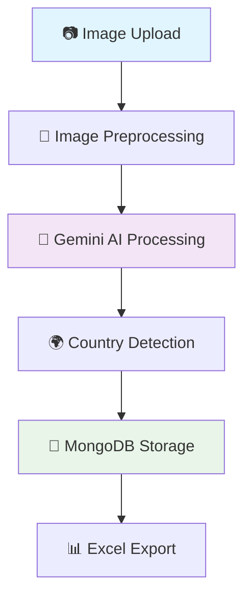

# 🎯 AI-Powered Visiting Card Scanner

<div align="center">


<h3>🚀 Extract structured data from visiting cards using Google's Gemini Vision AI</h3>

[](https://creativecommons.org/licenses/by-nc/4.0/)


</div>

---

## ✨ Features

| Feature | Description |
|---------|-------------|
| 🤖 **AI-Powered Extraction** | Uses Google Gemini Vision API for accurate text recognition |
| 📤 **Bulk Upload Support** | Process multiple visiting cards simultaneously |
| 🗄️ **MongoDB Integration** | Persistent data storage with full CRUD operations |
| 📊 **Excel Export** | Download extracted data as spreadsheet files |
| 🌍 **Country Detection** | Automatic country identification with flag emojis |
| ⚡ **Real-time Progress** | Live updates during bulk processing |
| 🎨 **Modern UI** | Clean, responsive web interface |
| 🔧 **Easy Management** | Edit and delete records through web interface |

---

## 🛠️ Technology Stack

<div align="center">

| Component | Technology | Purpose |
|-----------|------------|---------|
| **🤖 AI Engine** | Google Gemini Vision API | Text extraction from images |
| **🐍 Backend** | Flask 3.0+ | Web framework |
| **🗄️ Database** | MongoDB | Data persistence |
| **📦 Package Manager** | uv | Fast Python package management |
| **🖼️ Image Processing** | Pillow (PIL) | Image preprocessing |
| **🌐 Frontend** | HTML5 + CSS3 + JavaScript | User interface |
| **📄 Export** | openpyxl | Excel file generation |

</div>

---

## 🚀 Quick Start

### 📋 Prerequisites

<table>
<tr>
<td width="50%">

**🐍 Python Environment**
- Python 3.12 or higher
- uv package manager

</td>
<td width="50%">

**🔑 Required Services**
- MongoDB (local or cloud)
- Google Gemini API key

</td>
</tr>
</table>

### 🎯 Installation Steps

#### 1️⃣ Clone Repository
```bash
git clone <your-repository-url>
cd OCR_bulk_scanner
```

#### 2️⃣ Install uv Package Manager
```bash
# macOS/Linux
curl -LsSf https://astral.sh/uv/install.sh | sh

# Windows
powershell -c "irm https://astral.sh/uv/install.ps1 | iex"
```

#### 3️⃣ Install Dependencies
```bash
# Install all dependencies using uv
uv pip install -e .

# Alternative: Create virtual environment first
uv venv
source .venv/bin/activate  # On Windows: .venv\Scripts\activate
uv pip install -e .
```

#### 4️⃣ Environment Configuration
Create `.env` file in project root:

```env
# 🤖 Gemini AI Configuration
GEMINI_API_KEY=your-gemini-api-key-here

# 🌶️ Flask Configuration
SECRET_KEY=your-secret-key-here

# 🍃 MongoDB Configuration
MONGODB_URI=mongodb://localhost:27017/
MONGODB_DATABASE=visiting_card_db
MONGODB_COLLECTION=extractions
```

#### 5️⃣ Get Gemini API Key
1. 🌐 Visit [Google AI Studio](https://makersuite.google.com/app/apikey)
2. 🔑 Create a new API key
3. 📋 Copy and paste it into your `.env` file

#### 6️⃣ Launch Application
```bash
# Using uv (recommended)
uv run python main.py

# Or with activated virtual environment
python main.py
```

#### 7️⃣ Access the App
Open your browser and navigate to: **http://localhost:5000** 🌐

---

## 📖 How to Use

### 📸 Single Image Processing

<div align="center">

| Step | Action | Result |
|------|--------|--------|
| **1** | 🏠 Navigate to home page | Upload interface loads |
| **2** | 📁 Click "Choose Files" | File browser opens |
| **3** | 🖼️ Select visiting card image | Image preview shows |
| **4** | 🚀 Click "Upload and Extract" | AI processes the image |
| **5** | 📊 View extracted data | See results with country flags 🇺🇸🇮🇳🇬🇧 |

</div>

### 📁 Bulk Processing
- Select multiple images using **Ctrl/Cmd + Click**
- Upload all files simultaneously
- Monitor **real-time progress bar**
- Download **consolidated Excel report**

### 🔧 Data Management
- **👀 View**: All extracted records in management panel
- **✏️ Edit**: Modify data inline with instant updates
- **🗑️ Delete**: Remove unwanted entries
- **📄 Export**: Generate Excel files with filtered data

---

## 📁 Project Architecture

```
OCR_bulk_scanner/
├── 🐍 main.py                    # Application entry point
├── 📋 pyproject.toml             # uv package configuration
├── 🔒 uv.lock                   # Dependency lock file
├── 📄 LICENSE                   # Creative Commons license
├── 📖 README.md                 # This documentation
│
├── 📦 app/                      # Core application package
│   ├── 🔧 __init__.py           # Flask app factory
│   ├── 🛣️ routes.py             # API endpoints & views
│   ├── 🤖 ocr.py                # Gemini AI integration
│   ├── 🗄️ mongo.py              # MongoDB operations
│   └── 🛠️ utils.py              # Helper functions
│
├── 🎨 static/                   # Static web assets
│   ├── 💄 css/style.css         # Application styling
│   ├── ⚡ js/                   # JavaScript files
│   │   ├── script.js            # Main functionality
│   │   └── manage.js            # Data management
│   ├── 📤 uploads/              # Temporary file storage
│   └── 📊 results/              # Processing results
│
└── 🌐 templates/                # HTML templates
    ├── 🏠 index.html            # Main upload interface
    ├── 📋 manage.html           # Data management panel
    └── 📊 results.html          # Results display page
```

---

## 🔗 API Reference

<div align="center">

| Method | Endpoint | Description | Response |
|--------|----------|-------------|----------|
| `GET` | `/` | 🏠 Home page with upload form | HTML page |
| `POST` | `/upload` | 📤 Handle file uploads & AI processing | JSON results |
| `GET` | `/results` | 📊 Display extraction results | HTML page |
| `GET` | `/manage` | 🔧 Data management interface | HTML page |
| `POST` | `/api/update-record` | ✏️ Update extraction record | JSON status |
| `POST` | `/api/delete-record` | 🗑️ Delete extraction record | JSON status |
| `GET` | `/download-excel` | 📄 Export data to Excel | Excel file |

</div>

---

## 🔮 How It Works

<div align="center">



</div>

1. **📷 Image Upload**: Users upload visiting card images through the web interface
2. **🔄 Preprocessing**: Images are resized, converted to grayscale, and optimized for AI processing
3. **🤖 AI Processing**: Gemini Vision API analyzes the image and extracts structured data
4. **🌍 Country Detection**: Smart algorithm identifies country from address/phone patterns
5. **💾 Data Storage**: Results are saved to MongoDB with unique identifiers
6. **📊 Export**: Users can generate Excel files for easy data management

---

## 🎯 Key Features Deep Dive

### 🤖 Gemini AI Integration
- **🧠 Advanced Vision Model**: Uses Google's latest Gemini 1.5 Flash model
- **📋 Structured Output**: Returns consistent JSON format for all extractions
- **🌍 Multi-language Support**: Handles various card layouts and languages
- **⚡ Fast Processing**: Optimized for speed and accuracy

### 🗄️ MongoDB Storage
- **💾 Persistent Storage**: All data saved permanently in MongoDB
- **🔄 CRUD Operations**: Full Create, Read, Update, Delete functionality
- **📈 Scalable**: Handles large volumes of extraction records
- **🔍 Search & Filter**: Advanced querying capabilities

### 🌍 Smart Country Detection
- **🚩 40+ Countries Supported**: Automatic flag emoji assignment
- **📞 Phone Pattern Recognition**: Detects country from phone number formats
- **📍 Address Analysis**: Identifies location markers in text
- **🎯 Fallback Logic**: Multiple detection methods for accuracy

---

## 📊 Dependencies

This project uses the following key packages (managed by **uv**):

```toml
[project.dependencies]
Flask = ">=3.0.0"           # 🌶️ Web framework
Pillow = ">=10.1.0"         # 🖼️ Image processing
requests = ">=2.32.4"       # 🌐 HTTP requests for Gemini API
pymongo = ">=4.13.2"        # 🍃 MongoDB driver
openpyxl = ">=3.1.5"        # 📄 Excel file generation
python-dotenv = ">=1.0.0"   # 🔐 Environment variables
pycountry = ">=24.6.1"      # 🌍 Country data and flags
```

---

## 🚀 Deployment Options

### 🐳 Docker Deployment
```dockerfile
FROM python:3.12-slim

WORKDIR /app
COPY pyproject.toml ./
RUN pip install uv && uv pip install -e .

COPY . .
EXPOSE 5000

CMD ["python", "main.py"]
```

### ☁️ Cloud Platforms
- **🔥 Heroku**: `git push heroku main`
- **🌊 Railway**: Deploy with one-click
- **⚡ Vercel**: Serverless deployment
- **🐙 DigitalOcean**: App Platform deployment

---

## 🔧 Configuration

### 🌍 Environment Variables

| Variable | Required | Description | Example |
|----------|----------|-------------|---------|
| `GEMINI_API_KEY` | ✅ Yes | Google Gemini API key | `AIza...` |
| `SECRET_KEY` | ✅ Yes | Flask secret key | `your-secret-key` |
| `MONGODB_URI` | ✅ Yes | MongoDB connection string | `mongodb://localhost:27017/` |
| `MONGODB_DATABASE` | ❌ No | Database name | `visiting_card_db` |
| `MONGODB_COLLECTION` | ❌ No | Collection name | `extractions` |

### ⚙️ Advanced Settings
```python
# Optional configuration in app/__init__.py
app.config.update(
    MAX_CONTENT_LENGTH=16 * 1024 * 1024,  # 16MB file limit
    UPLOAD_FOLDER='static/uploads',
    RESULTS_FOLDER='static/results'
)
```

---

## 🧪 Testing

### 🔬 Run Tests
```bash
# Install development dependencies
uv pip install pytest pytest-cov

# Run all tests
pytest

# Run with coverage
pytest --cov=app tests/
```

### 📝 Test Structure
```
tests/
├── test_app.py          # Flask app tests
├── test_ocr.py          # Gemini AI tests
├── test_routes.py       # API endpoint tests
├── test_mongo.py        # Database tests
└── fixtures/            # Test data
    └── sample_cards/
```

---

## 🤝 Contributing

We welcome contributions! Here's how to get started:

### 🍴 Fork & Setup
```bash
# 1. Fork the repository on GitHub
# 2. Clone your fork
git clone https://github.com/YOUR_USERNAME/OCR_bulk_scanner.git
cd OCR_bulk_scanner

# 3. Create a feature branch
git checkout -b feature/amazing-feature

# 4. Install development dependencies
uv pip install -e ".[dev]"
```

### 📝 Development Guidelines
- 🧪 **Add tests** for new features
- 📚 **Update documentation** as needed
- 🎨 **Follow PEP 8** coding standards
- 💬 **Write clear commit messages**

### 🔄 Pull Request Process
1. ✅ Ensure all tests pass
2. 📋 Update README if needed
3. 🚀 Submit pull request with description
4. 👀 Wait for code review

---

## 📝 License

This project is licensed under the **Creative Commons Attribution-NonCommercial 4.0 International License**.

<div align="center">

[](http://creativecommons.org/licenses/by-nc/4.0/)

</div>

### 📋 License Summary

**✅ You are free to:**
- **📤 Share** — copy and redistribute the material in any medium or format
- **🔄 Adapt** — remix, transform, and build upon the material

**📏 Under the following terms:**
- **👤 Attribution** — You must give appropriate credit, provide a link to the license, and indicate if changes were made
- **🚫 NonCommercial** — You may not use the material for commercial purposes

📄 **[Full License Text](LICENSE)**

---

## 🆘 Support & Help

### 💬 Getting Help

| Need Help With | Where to Go |
|----------------|-------------|
| 🐛 **Bug Reports** | [Create an Issue](../../issues/new?template=bug_report.md) |
| 💡 **Feature Requests** | [Request Feature](../../issues/new?template=feature_request.md) |
| ❓ **Questions** | [GitHub Discussions](../../discussions) |
| 📖 **Documentation** | Read this README |

### 📞 Contact Information
- 📧 **Email**: [Create an issue](../../issues) (preferred)
- 💬 **Discussions**: [GitHub Discussions](../../discussions)
- 📚 **Wiki**: [Project Wiki](../../wiki)

---

## 🙏 Acknowledgments

<div align="center">

### 🏆 Special Thanks

</div>

| Contributor | Contribution |
|-------------|-------------|
| 🤖 **Google Gemini Team** | Powerful Vision AI API |
| 🌶️ **Flask Community** | Excellent web framework |
| 🍃 **MongoDB Team** | Reliable database solutions |
| 📦 **Astral Team** | Lightning-fast uv package manager |
| 🐍 **Python Community** | Amazing ecosystem and libraries |

### 🌟 Open Source Libraries
- **Flask** - Web framework
- **Pillow** - Image processing
- **PyMongo** - MongoDB driver
- **openpyxl** - Excel file handling
- **python-dotenv** - Environment management

---

## 📊 Project Stats

<div align="center">


</div>

---

<div align="center">

**🎉 Made with ❤️ and AI in 2025**


</div>
